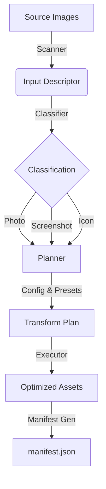

# AI Tools Photo Optimizer


Production-grade, adaptive image optimization toolchain built with TypeScript. It scans, classifies, and optimizes images for the web, generating a runtime manifest for intelligent loading.

## 🚀 Capabilities

- **Intelligent Scanning**: Auto-discovery of image assets via glob patterns.
- **Heuristic Classification**: Distinguishes photos, screenshots, and icons to apply tailored compression.
- **Adaptive Planning**: Generates optimization plans (format, size, quality) based on image type and config.
- **High-Performance Execution**: Uses `libvips` (via `sharp`) for blazingly fast parallel processing.
- **Runtime Manifest**: deterministically maps source files to optimized variants for O(1) runtime lookup.
- **Web Runtime**: 1kb client-side observer to automatically swap images.

## 🏗 Architecture Summary

The system follows a strict **scan -> plan -> execute** pipeline:



See [Implementation](docs/implementation.md) for deep dive.

## ⚡️ Tech Stack

- **Runtime**: Node.js v24.13.0+ (Strict)
- **Language**: TypeScript 5.0+
- **Image Engine**: [Sharp](https://sharp.pixelplumbing.com/) (libvips)
- **Package Manager**: PNPM (Monorepo via workspaces)
- **Testing**: Vitest
- **Linting**: ESLint + Prettier

## 🏁 Quick Start

### 1. Prerequisites
- Node.js v24+
- pnpm

### 2. Install & Build
```bash
git clone <repo-url>
cd aitool-photo-optimizer
pnpm install
pnpm build
```

### 3. Run Optimization
```bash
# Optimize all images in public/images
./packages/node/bin/apo.js build 'public/images/**/*.{jpg,png}' --out public/dist
```

See [First Run](docs/first-run.md) for detailed guide.

## 🛠 Configuration

Configuration is handled via `apo.config.json`.

```json
{
  "quality": 80,
  "formats": ["avif", "webp"],
  "presets": {
    "photo": "web-2025-balanced"
  }
}
```

See [Setup & Configuration](docs/setup.md).

## 🧪 Testing & Coverage

We use Vitest for unit and integration testing.

```bash
# Run tests
pnpm test

# Generate coverage
pnpm test --coverage
```

See [Testing](docs/testing.md) and [Coverage](docs/coverage.md).

## 📚 Documentation Index

- **[Installation](docs/install.md)**: Setup instructions.
- **[Configuration](docs/setup.md)**: Environment and config reference.
- **[First Run](docs/first-run.md)**: Step-by-step usage guide.
- **[Functionality](docs/functionality.md)**: Core features explained.
- **[Schema](docs/schema.md)**: Configuration schema definition.
- **[API Reference](docs/api.md)**: Interfaces and CLI commands.
- **[Integrations](docs/integrations.md)**: Third-party dependencies.
- **[Architecture](docs/implementation.md)**: Codebase layout and design.
- **[Testing](docs/testing.md)**: Test strategy and commands.
- **[Security](docs/security.md)**: Security policy and best practices.
- **[Troubleshooting](docs/troubleshooting.md)**: Common issues and fixes.
- **[Monorepo](docs/monorepo.md)**: Workspace structure.
- **[Contributing](docs/contributing.md)**: Developer guide.
- **[Changelog](docs/changelog.md)**: Version history.
- **[Agent Guide](docs/agent-contribution.md)**: Instructions for AI agents.

## 🤝 Contributing

We welcome contributions! Please see [Contributing](docs/contributing.md).

## 📄 License

MIT
