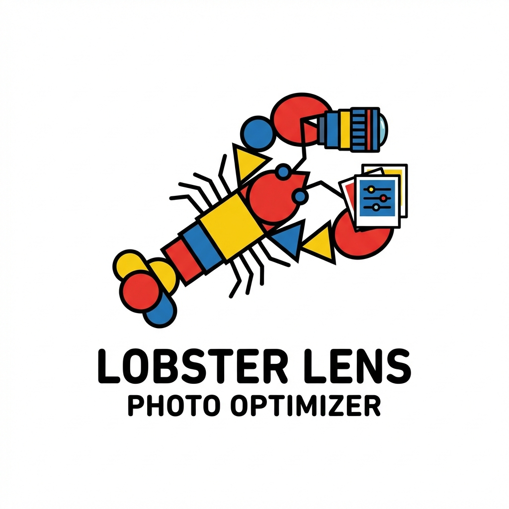

# AI Tools Photo Optimizer



A modern, monorepo-based adaptive image optimization tool built with TypeScript. This toolchain allows you to scan, classify, and optimize images for the web, generating a manifest for runtime usage.

## 📚 Documentation

Complete documentation is available in the [docs/](docs/README.md) directory.

- **[Installation](docs/install.md)**
- **[Setup & Config](docs/setup.md)**
- **[Functionality Overview](docs/functionality.md)**
- **[Architecture](docs/implementation.md)**
- **[API Reference](docs/api.md)**

## 📦 Packages

This project is organized as a monorepo:

- **[`@aitools-photo-optimizer/core`](packages/core)**: Pure TypeScript business logic (Planning, Hashing, Manifest).
- **[`@aitools-photo-optimizer/node`](packages/node)**: Node.js runtime, CLI, and Sharp-based image processing.
- **[`@aitools-photo-optimizer/web`](packages/web)**: Browser runtime for adaptive image loading/swapping.

## 🚀 Quick Start

### 1. Installation

```bash
pnpm install
pnpm build
```

See [Installation Docs](docs/install.md) for details.

### 2. CLI Usage

Generate optimized assets from your source images:

```bash
# Build optimized variants
./packages/node/bin/apo.js build 'public/images/*.{jpg,png}' --out public/optimized

# Update source files
./packages/node/bin/apo.js update-source --source 'src/**/*.html' --manifest public/optimized/manifest.json
```

See [First Run](docs/first-run.md) for a complete guide.

### 3. Web Runtime

Use the client-side library to adaptively serve optimized images:

```typescript
import { AutoOptimizer } from '@aitools-photo-optimizer/web';

const optimizer = new AutoOptimizer((src, width, format) => {
    // Map original src to optimized path
    return `/optimized/${src.split('/').pop()?.replace('.', '_')}.${format}`;
});

optimizer.start();
```

## 🏗 Architecture

The system uses a **Classifier -> Planner -> Executor** pipeline:

1.  **Scanner**: Finds images.
2.  **Classifier**: Determines image type (Photo, Screenshot, Icon).
3.  **Planner**: Creates an optimization plan based on config and classification.
4.  **Executor**: Uses `sharp` to process images locally (or potentially cloud).
5.  **Manifest**: records the mapping of source to optimized assets.

See [Architecture](docs/implementation.md) for more.

## 🧪 Testing

Run unit and integration tests:

```bash
pnpm test
```

See [Testing Strategy](docs/testing.md).

## 🤝 Contributing

We welcome contributions! Please see [Contributing](docs/contributing.md) for details.

## 📄 License

MIT
