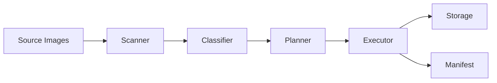

# Architecture & Implementation

This document details the internal architecture of the `@aitools-photo-optimizer` monorepo.

## System Design

The system follows a pipeline architecture pattern:



### Components

#### 1. Scanner
- **Package**: `node`
- **Responsibility**: Finds files matching user glob patterns.
- **Implementation**: Uses `fast-glob` to respect `.gitignore` and patterns.

#### 2. Classifier (`@aitools-photo-optimizer/node/src/classifier.ts`)
- **Responsibility**: Determines the nature of the image to select the best optimization preset.
- **Logic**:
  - Checks extensions (PNG vs JPG).
  - (Planned) Analyzes entropy/histogram (future).
  - Assigns types: `photo`, `screenshot`, `vector`, `icon`, `text`.

#### 3. Planner (`@aitools-photo-optimizer/core`)
- **Responsibility**: Pure logic that takes a descriptor + classification and produces a `TransformPlan`.
- **Logic**:
  - Looks up `OptimizerConfig`.
  - Generates a list of `TransformJob`s (e.g., "Make AVIF at q80", "Make WebP at q90").
  - Generates deterministic hashes for caching.

#### 4. Executor
- **Package**: `node`
- **Responsibility**: Executes the jobs.
- **Concurrency**: Uses a `LocalQueue` to limit concurrent `sharp` instances (default 4).
- **Processing**: Reads source buffer -> Pipes to Sharp -> Outputs Buffer -> Writes to `fs`.

#### 5. Manifest
- **Responsibility**: A JSON map linking `Source Path -> Optimized Assets`.
- **Structure**:
  ```json
  {
    "input/file.jpg": {
      "classification": "photo",
      "outputs": [
        { "format": "avif", "path": "hash.avif" },
        { "format": "webp", "path": "hash.webp" }
      ]
    }
  }
  ```

## Boundaries

- **Core**: Contains NO platform-specific code (no `fs`, no `sharp`, no DOM). It is purely data-in / data-out types and logic.
- **Node**: Contains all server-side I/O and heavyweight processing.
- **Web**: Contains minimal DOM logic.

## State Management

- **Build Time**: Stateless file processing. State is effectively the file system.
- **Run Time**: The `AutoOptimizer` maintains an internal cache of resolved images to prevent re-work during DOM interactions.
